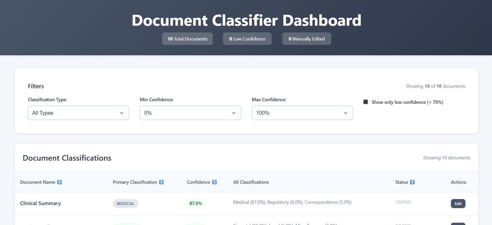

# Document Classifier Dashboard - Frontend

React application for managing AI document classifications with real-time filtering and editing capabilities.

## Features

- **Interactive Table** with sortable columns and status indicators
- **Advanced Filtering** by classification type and confidence range
- **Modal-based Editing** with score normalization
- **Low Confidence Highlighting** (< 70%) with visual warnings
- **Undo Functionality** 30-second window to revert changes after an edit
- **Responsive Design** optimized for all screen sizes

## Tech Stack

- React 18 + Vite
- Axios for API communication
- Custom responsive CSS

## Quick Start

```bash
# Install dependencies
npm install

# Start development server
npm run dev
```

**Prerequisites:** Backend API running on `http://localhost:3001`

## Project Structure

```
src/
├── components/          # React components
├── services/api.js     # API client
├── App.jsx            # Main application
└── App.css           # Responsive styles
```

## API Integration

- `GET /classifications` - Fetch documents with filtering
- `PATCH /classifications/:id` - Update classifications

## Scripts

```bash
npm run dev      # Development server
npm run build    # Production build
npm run preview  # Preview build
```

## Architecture

Built as part of a full-stack coding challenge demonstrating:
- Modern React patterns with hooks
- Professional UI/UX design
- RESTful API integration
- Responsive mobile-first design

**Backend Repository:** [doc-classifier-backend](https://github.com/Artjomeller/doc-classifier-backend)